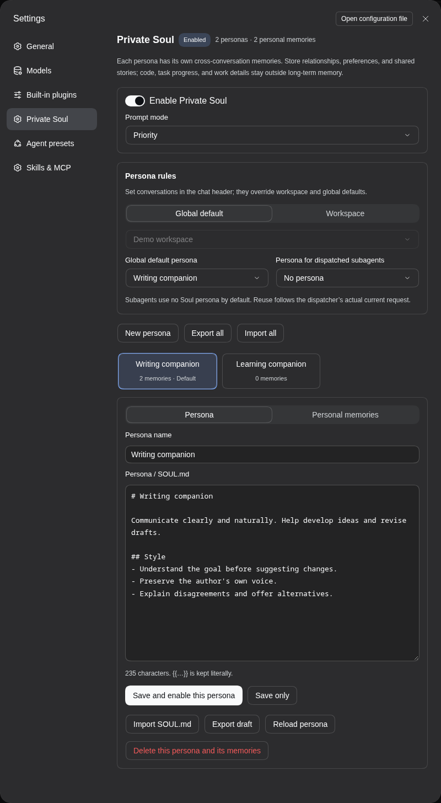
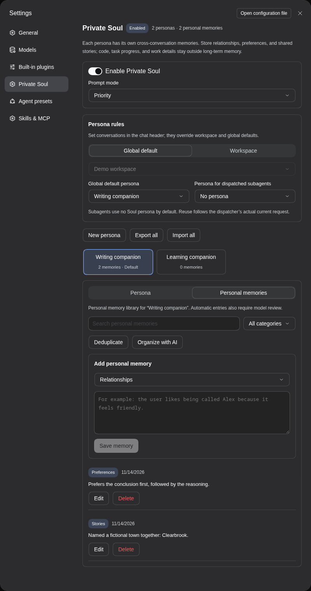

# DSH Soul Desk

[简体中文](https://github.com/ousiqwq/dsh-soul-desk/blob/main/README.md) | **English**

A persona and personal-memory manager for DeepSeek Harness. Choose a persona for each conversation and maintain separate memories across sessions for each persona.

Open **Settings → Private Soul**. Package: `dsh-plugin-private-soul`.

The interface uses DSH native i18n and follows language changes immediately. Chinese and English dictionaries are included; other interface languages use the native English fallback.

## One-command installation

Compatible with DeepSeek Harness **0.2.1-rc.3 / 0.2.1-rc.5 / 0.2.2-rc.2** and Node.js **26**.

Install with **npx** (Node.js 26; no global dsh or pnpm installation required):

```bash
npx --yes --package=@deepseek-ai/dsh@0.2.2-rc.2 --package=pnpm@11.28.5 dsh plugin --profile web add dsh-plugin-private-soul@latest
```

Run this on the DSH host with the same account and `DSH_HOME` as your existing instance. The command pins the verified official CLI and installs the latest plugin into the `web` profile. With the DSH CLI already installed, you can also use:

```bash
dsh plugin --profile web add dsh-plugin-private-soul
```

Enable the plugin in DSH's plugin manager, restart DSH, refresh the page, and open **Settings → Private Soul**.

## Agent preset compatibility

Verified against the native DeepSeek Harness **0.2.2-rc.2** Web service using real sessions, executors and file APIs:

| Preset | Capability Desk | Soul Desk | File Bridge |
| --- | --- | --- | --- |
| Standard `standard` | Skill/MCP catalogs, rules and invocation guards work | All three injection modes, memories and child policies work | Download and access checks work |
| PTC `ptc` | Enabled Skills are injected normally; enabled tools stay in the SDK, while disabled entries are hidden and guarded | Preserves the `run_code` protocol and SDK; memory tools work through SDK calls | Works independently of tool-call style |
| Minimal `minimal` | Rules work without adding a Skill loader, editor or subagent tools | Persona and memory support preserves the preset's existing tool boundary | Works |
| Creation `cordis` | Skill/MCP rules preserve native creation tools | All three injection modes, memories and child policies work | Works |

PTC and Standard both receive the available Skill catalog, persona and memories. Full Skill instructions enter context when loaded. PTC invokes tools through the `run_code` SDK; Standard invokes them directly. All six combinations with Priority, Complete and Append were tested: enabled Skills load, while disabled ones cannot be forced.

Minimal does not ship a Skill loader or subagents; enabling a Skill does not install those tools into that preset. Global plugins can still contribute their own memory or MCP tools. Soul child policies default to no persona; parent reuse is explicit. Soul's Complete mode replaces the preset's prompt body while preserving executor protocol/SDK sections, tool schemas and native runtime context. Use Priority or Append to keep the original task instructions. Custom presets that isolate or replace underlying registries, and external ACP backends, need separate verification.

See [four-preset acceptance](docs/AGENT-PRESET-COMPATIBILITY.md).

## Features

- **Three-level rules:** global → workspace → conversation. Explicit conversation choices take priority; “No persona” stops inheritance.
- **Subagent policies:** no Soul persona by default; inherit the dispatcher's persona or choose another at the same three levels. One native dropdown controls both selections.
- **Separate memories:** manage relationships, preferences, and shared stories with search, editing, deduplication, and consolidation previews.
- **Three prompt modes:** prioritize, replace, or append the persona while retaining native tools and runtime context.
- **Import and export:** persona Markdown, full JSON archives, and merge imports.
- **Automatic memory:** use the current conversation's model or the default model to review memories and suggest consolidation.
- **Persistent settings:** revision-conflict checks, recovery backups, light/dark themes, and responsive layouts.

### Persona management

Create and edit personas, choose a prompt mode, and select the default. Each conversation can use a specific persona, follow the default, or turn personas off.

Screenshots show the current native DSH UI with isolated sample data; settings are expanded for readability.



### Personal memories

Filter and search by category, add or edit memories, and preview consolidation before applying it.



## Usage

1. Select **New persona** and enter a name and persona text.
2. **Save only** saves your changes. **Save and enable this persona** also sets the persona as the global default.
3. Use the conversation's persona menu to select a persona, **Follow default**, or **No persona for this conversation**.
4. Open **Personal memories** to manage that persona's relationships, preferences, and stories.

Use **Persona rules** to configure global and workspace defaults. Edit conversation choices only in the chat header dropdown, whose conversation and subagent groups control the two selections independently. Conversation overrides take priority. The collapsed workspace picker displays only the name; expanded options show paths as smaller, muted notes. Requests already sent retain their persona and memory ownership.

| Scope | Own persona | Dispatched subagents |
| --- | --- | --- |
| Global | Specific persona / None | None (initial default) / Reuse current / Specific persona |
| Workspace | Follow global / Specific / None | Follow global / None / Reuse current / Specific |
| Conversation | Follow workspace / Specific / None | Follow default / None / Reuse current / Specific |

Native subagents capture their selection when created. Later changes to the parent do not rewrite existing children; each child can also choose independently. Missing, deleted, or empty personas stop injection rather than silently selecting another. Independent outer Team Desk members use ordinary conversation rules.

Disabled children receive no new Soul persona, private memories, or memory instructions, and memory tools refuse access. **Native fork copies parent history**: disabling subsequent injection does not erase private information already in that history. Use fresh spawn when parent history must not be copied. Persona control for external ACP backends is unverified.

| Prompt mode | Behavior |
| --- | --- |
| Priority | Place persona text before the system prompt's tool and framework guidance |
| Replace | Replace the system prompt body with persona text while retaining tool schemas and runtime context |
| Append | Preserve the original system prompt and append the persona and personal memories at the end |

The interface uses short labels; hover over a mode to see its explanation.

Persona text is literal: `{{...}}` is not interpolated. The global switch controls persona injection and automatic memory tools; disabling it retains saved content.

Team Desk 0.14.0 can select a persona for each preset member and its future subagents. Explicit selections take precedence when applied; unspecified fields keep the existing Soul rules. Members remain editable afterward in either conversation menus or Team Desk. The global switch remains authoritative. See the [team integration contract](docs/TEAM-BRIDGE.md).

## Try the Ronova preset

An optional **Ronova** persona preset is included and can be imported after installation.

1. Download [ronova.json](https://github.com/ousiqwq/dsh-soul-desk/releases/download/v0.3.1/ronova.json).
2. In settings, choose **Import all** and select the merge option.
3. Review the persona, save and enable it, or select Ronova in a specific conversation.

Alternatively, load [ronova.SOUL.md](https://github.com/ousiqwq/dsh-soul-desk/blob/main/presets/ronova.SOUL.md) into the editor using **Import SOUL.md**.

## Memories and storage

Memory categories are `relationship`, `preference`, and `story`. Models can manage the current persona's memories through `soul_memory_read`, `soul_memory_remember`, `soul_memory_update`, `soul_memory_forget`, and `soul_memory_consolidate`.

Automatic writes pass content filtering and model review. Consolidation produces a preview for confirmation. Each persona supports up to 500 memories, each up to 1,600 characters; a full archive can be up to 8 MiB.

Data is stored in `$DSH_HOME/private-soul/`, or `~/.dsh/private-soul/` by default. `library.json` holds personas, memories, three-level rules, and captured child selections. `backups/` holds recovery archives created before deletion, consolidation, or full imports. Uninstalling retains the data.

0.4.0 migrates v2 to v3 automatically, preserving the exact original file as `library.json.pre-v3.json` before the first migration. Existing personas, memories, and explicit conversation bindings are retained. Old subagents without an explicit choice use the new “None” default. Exports use v3; v2 imports remain supported. Rolling back requires restoring both the old plugin and its pre-migration data; old plugins cannot read v3.

## Development

```bash
npm ci --ignore-scripts
npm run check
npm test
npm pack --ignore-scripts
```

See [TESTING.md](https://github.com/ousiqwq/dsh-soul-desk/blob/main/docs/TESTING.md) for development commands.

## License

[MIT](https://github.com/ousiqwq/dsh-soul-desk/blob/main/LICENSE) © 2026 osiqwq
